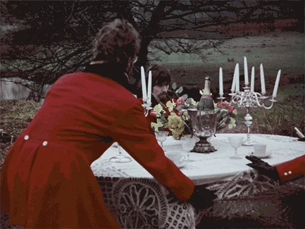
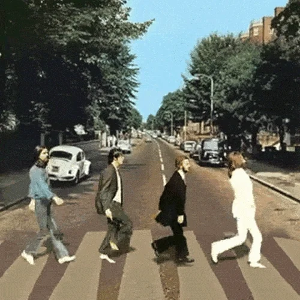
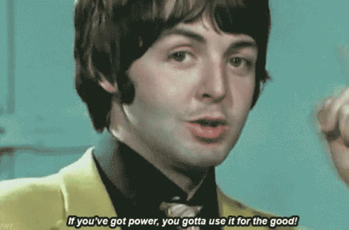
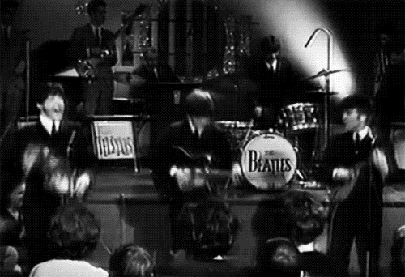

<!-- .slide: data-state="layout-title" class="bg-dark"-->

# Injeção de Dependência:
# Boas Práticas para Código Limpo

> >

---

<!-- .slide: data-state="layout-title" class="bg-dark"-->

# Antes de Tudo: Um Pouquinho de História e SOLID

- Single Responsibility Principle (SRP) - Princípio da Responsabilidade Única
- Open/Closed Principle (OCP) - Princípio Aberto/Fechado
- Liskov Substitution Principle (LSP) - Princípio da Substituição de Liskov
- Interface Segregation Principle (ISP) - Princípio da Segregação de Interfaces
- Dependency Inversion Principle (DIP) - Princípio da Inversão de Dependência

---

<!-- .slide: data-state="layout-title" class="bg-secondary"-->

# Decifrando o 'D' do SOLID


---
title: code
# Amarrados ao new: o que poderia dar errado?

```php [1|5-8|10-12]
class EmailController {
    private $mailerService;
    private $emailRequest;

    public function __construct() {
        $this->mailerService = new SmtpMailerService();
        $this->emailRequest = new EmailRequest();
    }

    public function sendEmail() {
        $this->mailerService->send($this->emailRequest);
    }
}
``` 

---
<!-- .slide: data-state="layout-title" class="bg-dark"-->
# O que parecia simples virou um pesadelo



---
<!-- .slide: data-state="layout-title" class="bg-danger"-->

# Problemas de Não Usar Injeção de Dependência:

- Forte Acoplamento
- Dificuldade em Testes
- Manutenção Difícil
- Dificuldade em Escalar o Sistema

---
<!-- .slide: data-state="layout-title" class="bg-dark"-->
# Dev tentando entender o espaguete da dependência...


---
<!-- .slide: data-state="layout-title" class="bg-danger"-->

# Problemas de Forte Acoplamento:

- Baixa Flexibilidade
- Menor Capacidade de Testes Isolados


---
# Separando as Preocupações: A Magia da Interface

```php [1-3|5-9|11-15]
interface MailerServiceInterface {
    public function send(EmailRequest $emailRequest): void;
}

class SmtpMailerService implements MailerServiceInterface {
    public function send(EmailRequest $emailRequest): void {
        // Código para enviar e-mail via SMTP
    }
}

class ApiMailerService implements MailerServiceInterface {
    public function send(EmailRequest $emailRequest): void {
        // Código para enviar e-mail via API de terceiros
    }
}

``` 
---
<!-- .slide: data-state="layout-title" class="bg-dark"-->

# Com isso estamos caminhando
# para uma arquitetura mais limpa.


---
# Injeção de Dependências em Ação: O Papel do Construtor

```php [2-6|5-9|8-10]
class EmailController {
    public function __construct(
        private readonly MailerServiceInterface $mailerService,
        private readonly EmailRequest $emailRequest
    ) {
    }

    public function sendEmail() {
        $this->mailerService->send($this->emailRequest);
    }
}

``` 
---
<!-- .slide: data-state="layout-title" class="bg-dark"-->

# Totalmente Mind Blowing


---

# Soluções com Injeção de Dependência
<!-- .slide: data-state="layout-title" class="bg-success"-->

- Desacoplamento
- Facilidade de Testes
- Manutenção Simplificada
- Facilidade de Extensão
---

<!-- .slide: data-state="layout-title" class="bg-dark"-->

# Acabou...


<p>quase, pode voltar</p>

---

<!-- .slide: data-state="layout-title" class="bg-dark"-->

# Não existe bala de prata



---
<!-- .slide: data-state="layout-title" class="bg-warning"-->
<h1 style="color: black;">Armadilhas Comuns e Como Evitá-las</h1>

- Dependency Hell
- Over-Engineering

---

<!-- .slide: data-state="layout-title" class="bg-dark"-->

# Acabou



---

<!-- .slide: data-state="layout-title" class="bg-dark"-->


---

# hora do café

<!-- .slide: data-state="layout-title" class="bg-dark"-->


---